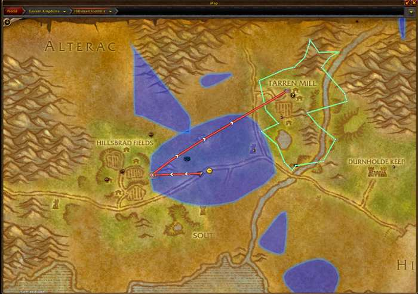
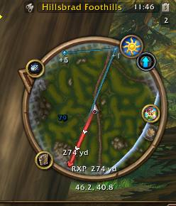
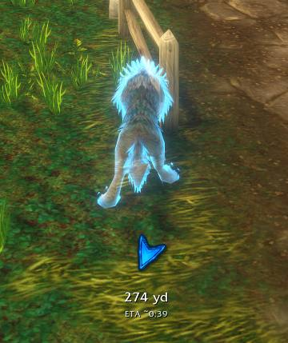

# RestedXP-Navigator

**RestedXP-Navigator** is a visual navigation companion for **RestedXP Guides / RXPGuides on WoW Forever**. It turns active guide targets into clear Minimap, World Map and HUD navigation without replacing or redistributing RestedXP guide content.

[CurseForge](https://www.curseforge.com/wow/addons/restedxp-navigator) · [Changelog](CHANGELOG.md) · [Report a bug](../../issues/new?template=bug_report.yml) · [Request a feature](../../issues/new?template=feature_request.yml)

## Screenshots

<table>
<tr>
<td width="50%" align="center"><strong>Minimap navigation</strong> </td>
<td width="50%" align="center"><strong>Navigation HUD</strong> </td>
</tr>
</table>

## Highlights

- Direct navigation to the active RestedXP destination
- Minimap and World Map route rendering
- Configurable on-screen navigation HUD
- Future-goal preview from **+1 to +6 steps**
- Smart travel routing for Hearthstone, flights, Zeppelins, ships and portals
- Quest-object / collectible markers with nearest-object highlighting
- Dedicated **Grind XP HUD** with live XP progress and percentage display
- Corpse-run navigation
- Farm, patrol and search-area overlays
- Integrated diagnostics and bug-report export

## What's new in 1.4.0

### Quest-object markers
RestedXP object-location loops can now be shown as individual markers on the World Map and Minimap instead of misleading connected route lines. Object classification, tooltips and nearest-object highlighting are included.

### Grind XP HUD
Active RestedXP grind steps now get a dedicated XP progress presentation below the navigation HUD with current XP, target XP, percentage progress and grind instruction text. ETA is hidden during grind steps so the HUD stays focused on progress.

## Requirements

- **WoW Forever 1.60.1**
- **RestedXP Guides / RXPGuides**
- TomTom is **not required**

## Installation

1. Download the latest `RestedXP-Navigator-vX.Y.Z.zip` from [GitHub Releases](https://github.com/Retronimrod/RestedXP-Navigator/releases) or CurseForge.
2. Extract the included `RXP_Navigator` folder into your WoW `Interface/AddOns` directory.
3. Ensure RestedXP Guides is installed and enabled.
4. Start the game and configure the addon with `/rxpnav options`.

## Commands

~~~text
/rxpnav options
/rxpnav toggle
/rxpnav goals 0|1|2|3|4|5|6
/rxpnav maptest
/rxpnav bugreport
/rxpnav status
/rxpnav reset
~~~

## Project structure

~~~text
Core/       Core navigation, resolvers and planners
Debug/      Diagnostics and inspector tools
Docs/       Architecture and project documentation
Map/        World Map and Minimap rendering
Media/      Addon textures and artwork
UI/         HUD, settings and tooltip presentation
RXP_Navigator.toc
~~~

## Development

The `main` branch contains the current development state. Stable versions are published as semantic version tags and GitHub Releases:

~~~text
v1.3.0
v1.4.0
v1.5.0
...
~~~

Release archives follow the naming convention:

~~~text
RestedXP-Navigator-v1.4.0.zip
~~~

Beta and hotfix identifiers may appear in development history and the changelog, but public release archives use the clean semantic version name.

## Disclaimer

RestedXP-Navigator is an **unofficial companion addon** for RestedXP Guides / RXPGuides.

It does not include, copy or redistribute RestedXP guide content. The addon provides visual navigation assistance only and does not automate character movement, combat, quest interaction, NPC interaction or gameplay input. All gameplay remains controlled by the player.

## License

All Rights Reserved. See [LICENSE](LICENSE).
